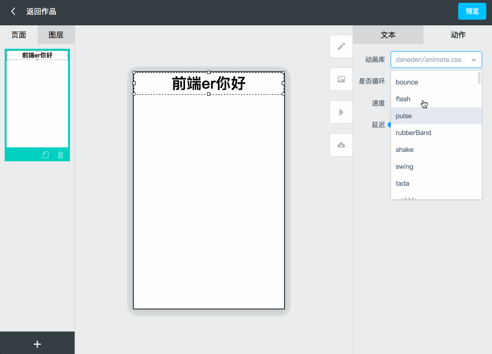

## h5在线编辑平台

`基于https://github.com/zhengguorong/h5maker进行二次开发`

### 技术架构
> 前端：vue2.0 + vue-router + vuex + axios + Element ui

> 后端：nodejs + express + mongoose

### <a href="http://h5.limesoftware.cn/">在线演示传送门</a>

### 演示效果

### 目录结构

### 运行方法
> npm install  // 安装依赖

> npm run webapp // 启动前端工程

> npm run local //  启动后端工程

### 问题记录
1. 编辑页面：跳转链接不能带 ‘http://'
2. 编辑页面：单页面无法调整页面高度
3. 编辑页面：图片素材库没有保存
4. 编辑页面：保存按钮位置调整到预览旁边。
5. 编辑页面：无法选择页面宽高
6. 编辑页面：增加新控件
7. 编辑页面：会出现
8. 预览弹窗：标题，描述没有保存按钮
9. 项目主页：预览图没有生成
